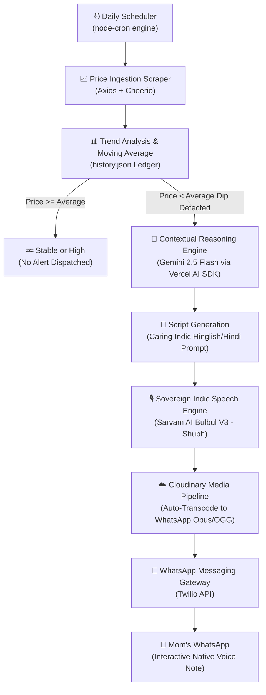

# Gold-Agent 🤖📈

> **An autonomous Indic AI agent that tracks gold rates, evaluates moving averages, and sends caring Hindi WhatsApp voice notes to your mom whenever the price drops.**

I automated myself out of my job as the family’s 24/7 Gold Price Help Desk. Now, instead of daily questions and explaining why gold moved up or down by ₹500, Gold-Agent silently monitors the market and bugs my mom *only* when it's genuinely a good time to buy—delivering the advice as a native Hindi WhatsApp voice note directly to her phone.

---

## 🏛️ Architecture Diagram



---

## ⚙️ How It Works Under the Hood

* 📈 **Price Ingestion:** Fetches daily 24K gold rates and compares them against a 15-day moving average (persisted via `history.json`) to detect genuine market dips rather than reacting to short-term noise.
* 🤖 **Contextual Analysis (The Brain):** Uses Gemini 2.5 Flash via the **Vercel AI SDK** as an autonomous financial consultant. When an attractive dip is identified, it generates a warm, caring 1-sentence Hinglish message tailored specifically for an Indian mother.
* 🗣️ **Native Voice Synthesis (The Voice):** Transforms the synthesized text into an expressive, natural Hindi voice message using **Sarvam AI’s Bulbul V3** model (`hi-IN`, speaker: `shubh`), capturing regional cadence and warmth.
* ☁️ **Cloud Transcoding & Codec Optimization:** WhatsApp requires voice notes to be encoded in the **Opus** audio codec wrapped in an **OGG** container. The generated audio is uploaded to Cloudinary with real-time transformation parameters (`audio_codec: "opus"`, `format: "ogg"`), yielding a production-ready CDN stream.
* 📲 **WhatsApp Delivery:** Triggers a WhatsApp media payload via the **Twilio Messaging API**, sending the audio note straight to Mom's phone as an interactive voice message she can tap and listen to with zero friction.

---

## 💭 The Problem Space: Why Native Voice Notes?

For non-tech-savvy Indian parents, standard financial tech tools introduce major friction:

* **Text & Notification Fatigue:** Cluttered SMS alerts and financial news apps are either ignored or misunderstood.
* **Linguistic Rigidity:** Traditional text-to-speech engines sound robotic, clinical, and lack the warm, natural code-mixed phrasing (*Hinglish*) typical of Indian families.
* **Media Friction:** Generic `.mp3` or `.wav` attachments do not render as playable voice notes in WhatsApp. WhatsApp users expect inline, tap-to-listen Push-To-Talk (PTT) voice messages.
* **Threshold-Based Alerts:** Instead of bothering her every single morning, the agent stays quiet when rates are flat or high, only alerting her when it counts.

---

## 🛠️ Tech Stack & Engineering Rationale

| Architecture Layer | Technology | Engineering Selection Reason |
| --- | --- | --- |
| **Inference Framework** | **Gemini 2.5 Flash + Vercel AI SDK** | Fast, deterministic text generation and clean structured prompt integration. |
| **Sovereign Indic Speech AI** | **Sarvam AI (Bulbul V3)** | Unmatched regional Indic language mastery and natural conversational Hindi pronunciation. |
| **Data Ingestion** | **Axios + Cheerio** | Lightweight, robust scraping of 24K gold rates without the overhead of headless browsers. |
| **Media Hosting & Transcoding** | **Cloudinary CDN** | In-flight audio codec conversion to WhatsApp-compliant Opus/OGG with secure CDN delivery. |
| **Messaging Gateway** | **Twilio API** | Industry-standard reliability for WhatsApp rich media voice note delivery. |
| **Runtime & Scheduling** | **Node-Cron & TSX** | Standalone TypeScript execution with automated cron scheduling. |

---

## 📁 Repository Structure

```txt
gold-agent/
├── src/
│   ├── index.ts        # Main orchestrator, moving average logic & cron scheduler
│   ├── fetcher.ts      # Scrapes 24K gold rates
│   ├── analyzer.ts     # Gemini 2.5 Flash analysis via Vercel AI SDK
│   ├── tts.ts          # Sarvam AI Bulbul V3 text-to-speech synthesis
│   ├── cloudinary.ts   # Cloudinary Opus/OGG audio transcoding & upload
│   ├── twilio.ts       # Twilio WhatsApp message dispatcher
│   ├── converter.ts    # Local fallback conversion utility
│   └── test.ts         # Testing sandbox
├── history.json        # Rolling price ledger for moving average
├── .env.example        # Environment variable definitions
├── package.json
└── tsconfig.json
```

---

## 🚀 Getting Started

### 1. Clone the Repository
```bash
git clone https://github.com/vishalsingh2972/gold-agent.git
cd gold-agent
```

### 2. Install Dependencies
```bash
npm install
```

### 3. Configure Environment Variables
Create a `.env` file in the root directory (refer to `.env.example`):
```env
# Google Gemini API Key
GOOGLE_GENERATIVE_AI_API_KEY=your_google_gemini_api_key

# Sarvam AI API Key
SARVAM_API_KEY=your_sarvam_ai_api_key

# Twilio Credentials
TWILIO_ACCOUNT_SID=your_twilio_account_sid
TWILIO_AUTH_TOKEN=your_twilio_auth_token
TWILIO_PHONE_NUMBER=whatsapp:+14155238886
MUMMY_PHONE_NUMBER=whatsapp:+91XXXXXXXXXX

# Cloudinary Credentials
CLOUDINARY_CLOUD_NAME=your_cloudinary_cloud_name
CLOUDINARY_API_KEY=your_cloudinary_api_key
CLOUDINARY_API_SECRET=your_cloudinary_api_secret
```

### 4. Run the Agent
Execute the agent once or keep it running to monitor based on the cron schedule:
```bash
npm run dev
# or
npx tsx src/index.ts
```

---

## ⭐ Community & Contributing

If this project helped you learn how to build real-world, culturally resonant AI agents, please **give this repo a ⭐**!

*And if your mom has started asking you for the daily gold price, do yourself a favor: clone this, deploy it, and let the AI handle the morning updates. It’s the perfect way to keep her informed while you officially retire from your role as the family's 24/7 financial advisor. You’ll both thank me later!*
